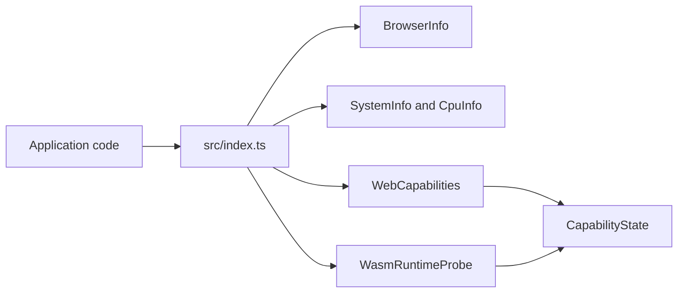

# web-capabilities Architecture

## Scope

`@webex/web-capabilities` is a small browser-side library with helpers for browser or system information and for estimating whether certain features are likely to work in the current environment.

Consumers read the public exports from `src/index.ts`. This page summarizes the main areas of the package. Method-level detail belongs in source, tests, and generated API docs under `docs/api/`.

## Main areas

| Area               | Role                                                                             |
| ------------------ | -------------------------------------------------------------------------------- |
| `BrowserInfo`      | Browser, OS, engine, and version helpers via the `bowser` dependency             |
| `SystemInfo`       | Logical CPU core count and optional Compute Pressure API helpers                 |
| `CpuInfo`          | Deprecated wrapper around core count; kept for compatibility                     |
| `WebCapabilities`  | Synchronous checks for feature support, codecs, WebRTC APIs, and hardware limits |
| `WasmRuntimeProbe` | Optional async check for whether WASM runs fast enough for heavy effects         |

## CapabilityState

All capability helpers return `CapabilityState`:

- `CAPABLE` — enough signal that the requirement is met
- `NOT_CAPABLE` — enough signal that it is not met
- `UNKNOWN` — not enough information to decide

These are library outcomes. Callers decide how to use them in product logic.

## Synchronous checks

`WebCapabilities` inspects browser globals, codec capabilities, core count, and related signals. Examples include background noise removal, virtual background, video codec support, encoded stream transforms, and RTCPeerConnection availability.

When a required signal is missing, methods return `UNKNOWN` instead of guessing. See `src/web-capabilities.ts` and its tests for the full method list and thresholds.

## Browser and system helpers

`BrowserInfo` centralizes user-agent parsing and version comparisons. Use it when a check depends on browser name or version rather than adding new parsing elsewhere.

`SystemInfo` is the preferred source for core count and CPU pressure events. Prefer it over `CpuInfo` in new code.

## WASM: present versus fast enough

Two APIs answer different questions:

| API                              | Question                                     | When                       |
| -------------------------------- | -------------------------------------------- | -------------------------- |
| `WebCapabilities.supportsWasm()` | Is WASM available?                           | Sync, cheap                |
| `WasmRuntimeProbe.check()`       | Is WASM fast enough for real-time WASM work? | Async, cached for the page |

Do not treat one result as a substitute for the other. WASM can be available but too slow in some browser modes.

The probe runs a short benchmark in a Web Worker. Rollup embeds `wasm-runtime-probe.worker.js` into the published bundle as source text. At runtime the probe starts that worker from a Blob URL, then terminates it and revokes the URL when finished.

Classification uses timing ratios and fixed thresholds. Order of checks, visibility handling, timeout behavior, and reason codes are correctness-sensitive. See `src/wasm-runtime-probe.ts` and `src/wasm-runtime-probe.spec.ts` before changing them.

## Build, test, and release

- Rollup publishes ESM, CommonJS, and TypeScript declarations from `src/index.ts`.
- Jest runs in jsdom; worker source uses a raw transform in tests.
- TypeDoc output goes to `docs/api/` and must not overwrite `docs/knowledge-base/` or `docs/contributing/`.
- Pull-request CI runs lint, Prettier, spelling, TypeScript validation, build, and coverage. Release on `main` builds and runs semantic-release.

Runtime dependency: `bowser` only.

## Compatibility notes

- Keep `supportsWasm()` separate from `WasmRuntimeProbe.check()`.
- Preserve worker termination and Blob URL cleanup in the probe.
- Treat export, threshold, and classification changes as semver-sensitive.
